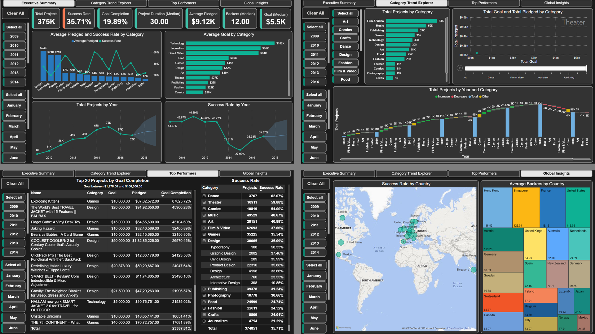
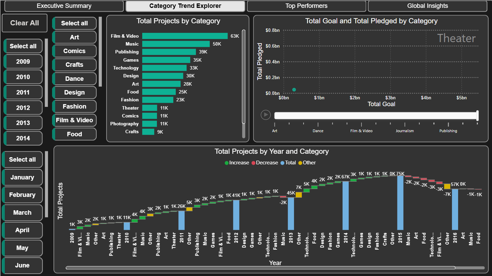

# Kickstarter Projects Analysis

## Table of Contents
- [Introduction](#Introduction)
- [Problem Statement](#Problem-Statement)
- [Project Overview](#Project-Overview)
- [Dataset](#Dataset)
- [Data Cleaning and Preparation](#Data-Cleaning-and-Preparation)
- [Data Model](#Data-Model)
- [Analysis and Visualizations](#Analysis-and-Visualizations)
- [Results](#Results)
- [Tools and Technologies](#Tools-and-Technologies)
- [File Structure](#File-Structure)
- [Getting Started](#Getting-Started)

## Introduction

A comprehensive exploration of Kickstarter Projects dataset, featuring data cleaning, SQL-driven analytics, and interactive Power BI visualizations.




## Problem Statement

Many creators struggle to understand which project categories, regions, and timing strategies lead to successful crowdfunding projects. Without clear, data-driven insights, project planning relies on guesswork rather than proven performance metrics.


## Project Overview

This project uncovers actionable patterns in over 370,000 Kickstarter listings by:
- Cleaning, standardizing, and enriching raw project records, including multi‐currency normalization and missing‐value handling
- Engineering key features such as project duration, funding ratio, backer acceleration curves, and categorical flags
- Computing overall and segment‐level success rates, goal completion percentages, and median backer counts
- Visualizing time‐based trends in project launches, success rates, and funding volumes across years and months
- Mapping geographic backer engagement to pinpoint high‐performance regions and under-leveraged markets
- Ranking and profiling top projects by goal completion to highlight viral success stories and funding anomalies
- Dissecting category and subcategory dynamics to surface high-impact niches and resource allocation insights
- Analyzing project duration, update cadence, and early momentum as predictors of funding outcomes
- Building an interactive Power BI dashboard with drill-down filters for year, month, category, and country
- Recommending strategic guidance for creators—optimal launch windows, target geographies, and goal‐setting thresholds 


## Dataset

Publicly available Kickstarter Projects dataset (2009–2017)
<br>
https://mavenanalytics.io/data-playground?order=date_added%2Cdesc&page=11&pageSize=5


## Data Cleaning and Preparation

- Corrected an incorrect documentary title: Replaced “11-04-2008” with the accurate title “11/4/08”.
- Handled literal placeholder entry: Removed the erroneous “#NAME?” value.
- Removed cancellation tags: Stripped “(Canceled)” from project names where it was appended.
&nbsp;
  


## Data Model

- Star schema: cleaned_kickstarter_projects fact table joined to a Date dimension table and Time dimension table.
- Marked Dim_Date and Dim_Time for time intelligence.


## Analysis and Visualizations

### **PostgreSQL Queries**:-

  - Success rates by category  
  - Top 50 projects by pledge-to-goal ratio  
  - Average pledge ratios and monthly success trends  
  - Geographic breakdown of total pledges and average backers  
  - Category-level backer rankings  


### **Power BI Report**:-

  - ### Page 1 – Executive Summary  
   
    

    - The top section displays key metrics, including Total Projects, Success Rate, Goal Completion, Median Duration, Average Pledged, Median Backers, and Median Goal.  
    - The left section contains filters for Year and Month.  
    - The middle section includes two charts: a column and line chart for Average Pledged and Success Rate by Category, and a bar chart for Average Goal by Category.  
    - The bottom section features two line charts for Total Projects by Year (2009–2017) and Success Rate by Year (2009–2017), with forecasting for 2018 and 2019.    


  - ### Page 2 – Category Trend Explorer

    

    - Category selection and time filters for Year and Month.  
    - Bar chart showing project counts across categories, and scatter plot with `play button` comparing total funding goals and pledged amounts across categories.  
    - The bottom section features a waterfall chart illustrating annual project counts with color coding for increases, decreases, totals, and “other” variations by category.
  
  - ### Page 3 – Top Performers
    
      
    
    - A handful of viral games and design gadgets achieve astronomical goal completion, proving that novelty plus community hype can outstrip even ambitious targets.
    - Projects with modest goals (e.g., Exploding Kittens, Fidget Cube) often unlock the biggest multiples, highlighting the power of viral word‐of‐mouth and collectability.
    - Performance-based categories (Dance, Theater, Comics) lead success rates above 50%, suggesting that backers gravitate toward shareable experiences and narrative‐driven projects.
    - The overall Design success rate masks wide variation across its subdomains—critical insight for creators choosing where to focus their efforts.

  - ### Page 4 – Global Insights

    

    - Success Rate by Country: Visualized on a world map with green circles indicating various countries. Circle size represents the project success rate.  
    - Average Backers by Country: Displayed as a tree map, with each rectangle representing a country. The size of each rectangle corresponds to the average number of backers.  
    - The left section contains filters for Year and Month.  

## Results
- **Funding Leaders:** The **Design** category recorded the highest average pledge at **$24,420.64**, while **Crafts** had the lowest at **$1,632.91**.  

- **Success Rates by Category:** The **Dance** category achieved the highest success rate at **62.07%**, followed closely by **Theater** at **59.88%**. In contrast, **Technology** recorded the lowest success rate at **19.76%**.  

- **Project Goals:** The **Technology** category projects set the highest average funding goals (**$102,202.38**), whereas **Dance** had the lowest (**$9,580.25**).  

- **Yearly Trends:** Year **2015** saw the largest number of projects (**74,919**), yet it also had the lowest success rate of the period at **27.99%**.  
  The highest success rate occurred in **2011** at **46.39%**, with **26,236** projects launched that year.  

- **Volume by Category:** The **Film & Video** category had the highest total number of projects (**62,693**), while **Dance** had the fewest (**3,767**).  

- **Category Growth & Decline:** From **2013 to 2014**, **Technology** experienced the largest growth in total projects (**+6,455**, a **253.5%** increase), followed by **Food** (**+4,203**, **186.06%** increase).  
  From **2015 to 2016**, **Film & Video** saw the largest decline (**-2,864**, **-29.54%**), with **Technology** close behind (**-2,676**, **-27.58%**).  

- **Geographic Performance:** The **United States** achieved the highest success rate among countries at **37.35%**, while **Italy** recorded the lowest at **15.25%**.  


## Tools and Technologies

- Power BI Desktop
- Microsoft Excel 2021
- PostgreSQL


## File Structure

```
├── data/
│   ├── cleaned_kickstarter_projects.csv
│   ├── cleaned_kickstarter_projects.xlsx
│   └── kickstarter_projects.csv
│   └── kickstarter_projects_data_dictionary.csv
├── images/
│   ├── issues_log/
│   │   └── issues_log.png
│   ├── report/
│   │   ├── executive_summary.png
│   │   ├── category_trend_explorer.png
│   │   ├── table_and_matrix.png
│   │   └── map.png
│   └── report_pages.png
├── report/
│   └── report_kickstarter_projects.pbix
├── sql/
│   └── kickstarter_projects_analysis.sql
│   └── table.sql
└── README.md
```


## Getting Started

1. Clone or download this repository.
2. Open report_kickstarter_projects.pbix in Power BI Desktop (v2.78+).
3. In Power BI Desktop, go to Transform data → Data source settings, and point the Excel data source to data/`cleaned_kickstarter_projects.xlsx` or `cleaned_kickstarter_projects.csv`
4. In the Navigator window, select the `cleaned_kickstarter_projects` (for .xlsx file), then click load.
5. Click refresh to load and apply all preconfigured Power Query transforms.
6. Explore the report.